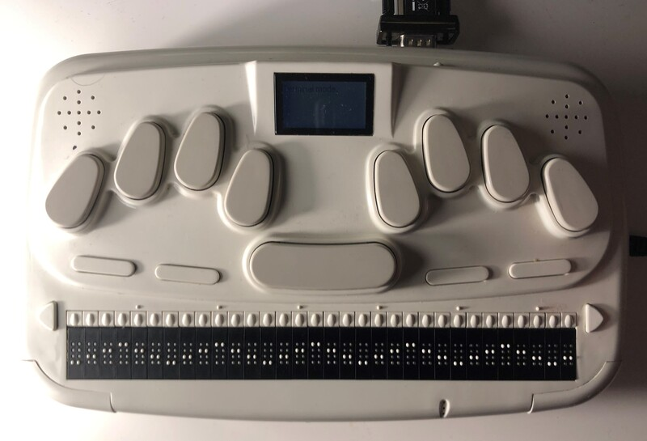

# Processing Braille

Collection of braille experiments with processing, using an ancient (2004) *HIMS Braille Sense*.

- can be used as braille terminal via serial port or USB
- modern versions of *Braille Sense* still use the same protocol, but connect via bluetooth.

# Sketches

- `braillekeyboard` — simulation of a [perkins keyboard](https://en.wikipedia.org/wiki/Perkins_Brailler) with an on-screen braille line
- `brailleascii` — translating keyboard input to braille using [Braille ASCII](https://en.wikipedia.org/wiki/Braille_ASCII)
- `braillesense_input` — simple demo of receiving input from a braille-sense device
- `braillesense` – controlling the braillesense braille line from processing

# Hardware

- *Braille Sense H-200*
    - Portable Braille Computer
    - Perkins style keyboard, i.e. 8 keys for braille input
    - space, function and cursor routing keys
    - Braille line with 32 braille chars

- Serial to USB Adapter (FTDI)
- Make sure to start terminal mode on the braille sense and select the serial port:  
    `utilies > terminal for screenreader > serial port` 

# Braille Sense Protocol

- Reverse-engineered the incoming packages using [HTerm](http://der-hammer.info/pages/terminal.html)
- Discovered the structure of outgoing packages in the sourcecode of [brlltty](https://brltty.app/) (See [here](https://github.com/brltty/brltty/blob/dc1bb832dcf034cf9376a4cffaea32893424b003/Drivers/Braille/HIMS/braille.c))

# License

MIT licensed